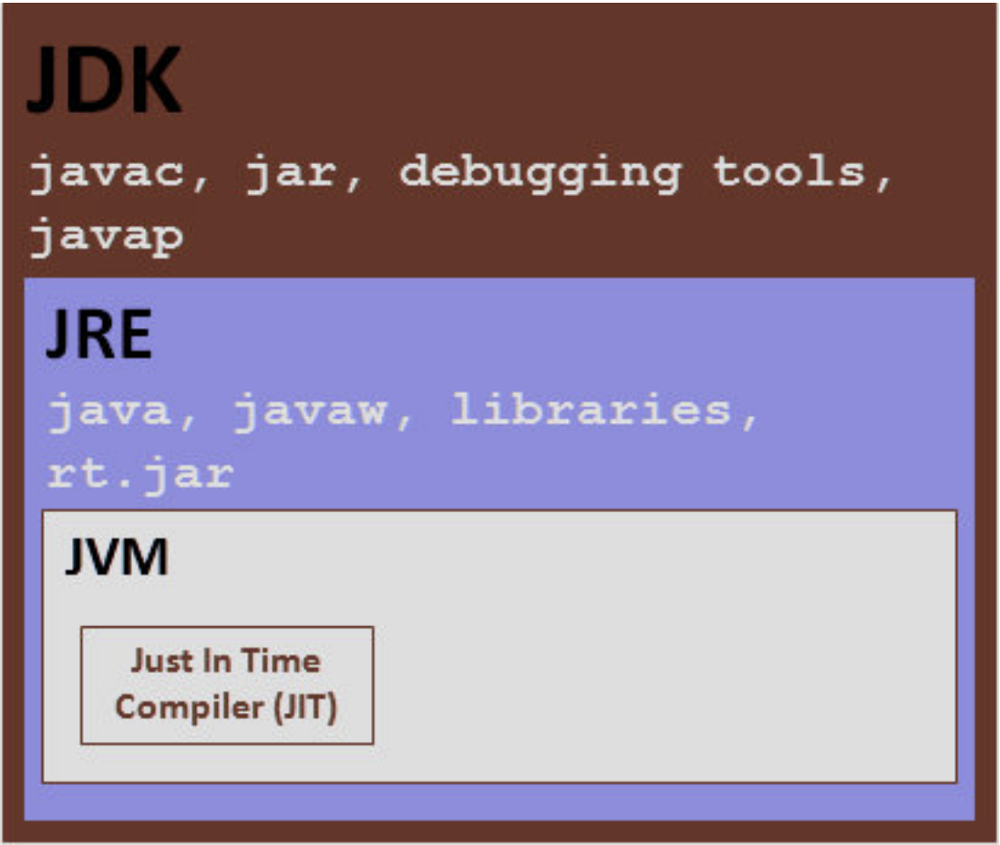

# Java-Interview-Questions

## Java Platform

### 1. Why is Java so Popular?

**Answer:**
Two main reasons for popularity of Java are

1. Platform Independence
2. Object Oriented Language

### 2. What is Platform Independence?

**Answer:**

- Platform Independence is also called build once, run anywhere. Java is one of the most popular platform
  independent languages. Once we compile a java program and build a jar, we can run the jar (compiled
  java program) in any Operating System - where a JVM is installed.
- Java achieves Platform Independence in a beautiful way. On compiling a java file the output is a class file which contains an internal java representation called bytecode. JVM converts bytecode to executable
  instructions. The executable instructions are different in different operating systems. So, there are
  different JVM's for different operating systems. A JVM for windows is different from a JVM for mac.
  However, both the JVM's understand the bytecode and convert it to the executable code for the
  respective operating system.

### 3. What is ByteCode?

**Answer:**
Java bytecode is the instruction set of the Java virtual machine. Each bytecode is composed of one, or in
some cases two bytes that represent the instruction (opcode), along with zero or more bytes for passing
parameters.

### 4. Compare JDK vs JVM VS JRE.

**Answer:**



1. JVM
   a. Virtual machine that run the Java bytecode.
   b. Makes java portable.
2. JRE
   a. JVM + Libraries + Other Components (to run applets and other java applications)

3. JDK
   a. JRE + Compilers + Debuggers

### 5. What are the important differences between C++ and Java?

**Answer:**

1. Java is platform independent. C++ is not platform independent.
2. Java & C++ are both NOT pure Object Oriented Languages. However, Java is more purer Object
   Oriented Language (except for primitive variables). In C++, one can write structural programs
   without using objects.
3. C++ has pointers (access to internal memory). Java has no concept called pointers.
4. In C++, programmer has to handle memory management. A programmer has to write code to
   remove an object from memory. In Java, JVM takes care of removing objects from memory
   using a process called Garbage Collection.
5. C++ supports Multiple Inheritance. Java does not support Multiple Inheritance.

### Bonus. What is the difference between == and .equals() in Java?

**Answer:**

== is used to compare the references (memory addresses) of two objects.

.equals() is used to compare the content (data inside the objects).

### 6. What is the role for a ClassLoader in Java?

**Answer:**
A Java program is made up of a number of custom classes (written by programmers like us) and core
classes (which come pre-packaged with Java). When a program is executed, JVM needs to load the
content of all the needed class. JVM uses a ClassLoader to find the classes.

Three Class Loaders are shown in the picture

- System Class Loader - Loads all classes from CLASSPATH
- Extension Class Loader - Loads all classes from extension directory
- Bootstrap Class Loader - Loads all the Java core files

When JVM needs to find a class, it starts with System Class Loader. If it is not found, it checks with
Extension Class Loader. If it not found, it goes to the Bootstrap Class Loader. If a class is still not found, a ClassNotFoundException is thrown.

## Wrapper Classes

### 7. What are wrapper classes?

**Answer:**
A primitive wrapper class in the Java programming language is one of eight classes provided in the
java.lang package to provide object methods for the eight primitive types. All of the primitive wrapper
classes in Java are immutable.

Wrapper: Boolean,Byte,Character,Double,Float,Integer,Long,Short

Primitive: boolean,byte,char ,double, float, int , long,short

### 8. Why do we need Wrapper Classes in Java?

**Answer:**
A wrapper class wraps (encloses) around a data type and gives it an object appearance.

Reasons why we need Wrapper Classes

- null is a possible value
- use it in a Collection
- Methods that support Object like creation from other types.. like String
- `Integer	number2 =	new Integer("55");//String *Deprecated since Java9 Instead we can use Integer.parseInt("55") or Integer.valueOf("55")`

### 9. What are the different ways of creating Wrapper Class Instances?

**Answer:**
Two ways of creating Wrapper Class Instances are described below.

1. Using a Wrapper Class Constructor

```
Integer	number =	new Integer(55);//int
Float	number3 =	new Float(55.0);//double	argument
Float	number4 =	new Float(55.0f);//float	argument
Float	number5 =	new Float("55.0f");//String

Character	c1 =	new Character('C');//Only	char	constructor
//Character	c2	=	new	Character(124);//COMPILER	ERROR
Boolean	b =	new Boolean(true);
//"true"	"True"	"tRUe"	- all	String	Values	give	True

//Anything	else	gives	false
Boolean	b1 =	new Boolean("true");//value	stored	- true
Boolean	b2 =	new Boolean("True");//value	stored	- true
Boolean	b3 =	new Boolean("False");//value	stored	- false
Boolean	b4 =	new Boolean("SomeString");//value	stored	- false
```

2. valueOf Static Methods

Provide another way of creating a Wrapper Object

```
Integer	hundred =	Integer.valueOf("100");//100	is	stored	in	variable
Integer	seven	=	Integer.valueOf("111",	2);//binary	111	is	converted	to	7
```

### 10. What are differences in the two ways of creating Wrapper Classes?

**Answer:**

The difference is that using the Constructor you will always create a new object, while using valueOf()
static method, it may return you a cached value with-in a range.
For example : The cached values for long are between [-128 to 127].
We should prefer static valueOf method, because it may save you some memory. To understand it further,
here is an implementation of valueOf method in the Long class.

```
 /**
 * Returns an {@code Integer} instance representing the specified
 * {@code int} value. If a new {@code Integer} instance is not
 * required, this method should generally be used in preference to
 * the constructor {@link #Integer(int)}, as this method is likely
 * to yield significantly better space and time performance by
 * caching frequently requested values.
 *
 * This method will always cache values in the range -128 to 127,
 * inclusive, and may cache other values outside of this range.
 *
 * @param i an {@code int} value.
 * @return an {@code Integer} instance representing {@code i}.
 * @since 1.5
 */
 public static Integer valueOf(int i) {
    if (i >= IntegerCache.low && i <= IntegerCache.high)
        return IntegerCache.cache[i + (-IntegerCache.low)];
        return new Integer(i);
}
```

### 11. What is Auto Boxing?

**Answer:**
Auto-boxing is the automatic conversion that the Java compiler makes between the primitive types and
their corresponding object wrapper classes. For example, converting an int to an Integer, a double to a
Double, and so on. If the conversion goes the other way, this is called autoboxing.

Example 1

`Integer	nineC	=	9;`

Example 2

`Integer	ten	=	new Integer(10);`

`ten++;` //allowed.

Java does had work behind the screen for us

### 12. What are the advantages of Auto Boxing?

**Answer:**
Auto Boxing helps in saving memory by reusing already created Wrapper objects. Auto Boxing uses the
static valueOf methods. However wrapper classes created using new are not reused.
Two wrapper objects created using new are not same object.

```
Integer	nineA	=	new Integer(9);
Integer	nineB	=	new Integer(9);
System.out.println(nineA	==	nineB);//false
System.out.println(nineA.equals(nineB));//true
```

Two wrapper objects created using boxing are same object.

```
Integer	nineC	=	9;
Integer	nineD	=	9;
System.out.println(nineC	==	nineD);//true
System.out.println(nineC.equals(nineD));//true
```

### 13. What is Casting?

**Answer:**
Casting is used when we want to convert on data type to another.
There are two types of Casting.

- Implicit Casting
- Explicit Casting

### 14. What is Implicit Casting?

**Answer:**
Implicit Casting is done by the compiler. Good examples of implicit casting are all the automatic widening
conversions i.e. storing smaller values in larger variable types.

```
int value	=	100;
long number =	value;	//Implicit	Casting
float f =	100;	//Implicit	Casting
```

### 15. What is Explicit Casting?

**Answer:**
Explicit Casting is done through code. Good examples of explicit casting are the narrowing conversions.
Storing larger values into smaller variable types;

```
long number1	=	25678;
int number2 =	(int)number1; //Explicit	Casting
//int x	=	35.35; //COMPILER	ERROR
int x =	(int)35.35; //Explicit	Casting
```

Explicit casting would cause truncation of value if the value stored is greater than the size of the variable.

```
int bigValue	=	280;
byte small	=	(byte)	bigValue;
System.out.println(small);//output	24.	Only	8	bits	remain.
```

## Strings

### DEF. mutable and immutable defination.

**Answer:**
Mutable:
An object is mutable if its state (data) can be changed after it is created.
Example: StringBuilder, ArrayList.

Immutable:
An object is immutable if its state cannot be changed once it is created.
Example: String, Integer.

### 16. Are all String’s immutable?

**Answer:**
Value of a String Object once created cannot be modified. Any modification on a String object creates a
new String object.

```
String	str3	=	"value1";
str3.concat("value2");
System.out.println(str3);	//value1
```

Note that the value of str3 is not modified in the above example. The result should be assigned to a new
reference variable (or same variable can be reused). All wrapper class instances are immutable too!

```
String	concat	=	str3.concat("value2");
System.out.println(concat);	//value1value2
```

### 17. Where are string values stored in memory?

**Answer:**
The location where the string values are stored in memory depends on how we create them.

1. Approach 1

   In the example below we are directly referencing a String literal.

   `String	str1 =	"value";	`

   This value will be stored in a "String constant pool" – which is inside the Heap memory. If compiler finds
   a String literal,it checks if it exists in the pool. If it exists, it is reused.

   `String	str5 =	"value";	`

   In above example, when str5 is created - the existing value from String Constant Pool is reused.

2. Approach 2

   However, if new operator is used to create string object, the new object is created on the heap. There
   will not be any reuse of values.

   ```
   //String	Object	- created	on	the	heap
   String	str2 =	new String("value");
   ```

### 18. Why should you be careful about String Concatenation(+) operator in Loops?

**Answer:**
Consider the code below:

```String s3 = "Value1";
String s2 = "Value2";
for (int i = 0; i < 100000; ++i) {
s3 = s3 + s2;
}
```

How many objects are created in memory? More than 100000 Strings are created. This will have a huge
performance impact.

### 19. How do you solve above problem?

**Answer:**
The easiest way to solve above problem is using StringBuffer. On my machine StringBuffer version took
0.5 seconds. String version took 25 Seconds. That’s a 50 fold increase in performance.

```StringBuffer s3 = new StringBuffer("Value1");
String s2 = "Value2";
for (int i = 0; i < 100000; ++i) {
s3.append(s2);
}
```

### 20. What are differences between String and StringBuffer?

**Answer:**

- Objects of type String are immutable. StringBuffer is used to represent values that can be
  modified.
- In situations where values are modified a number to times, StringBuffer yields significant
  performance benefits.
- Both String and StringBuffer are thread-safe.
- StringBuffer is implemented by using synchronized keyword on all methods.

### 21. What are differences between StringBuilder and StringBuffer?

**Answer:**
StringBuilder is not thread safe. So, it performs better in situations where thread safety is not required.

### 22. Can you give examples of different utility methods in String class?

**Answer:**
String class defines a number of methods to get information about the string content.

`String	str	=	"abcdefghijk";`

Get information from String
Following methods help to get information from a String.

```
//char	charAt(int paramInt)

System.out.println(str.charAt(2));	//prints	a	char	- c
System.out.println("ABCDEFGH".length());//8
System.out.println("abcdefghij".toString());	//abcdefghij
System.out.println("ABC".equalsIgnoreCase("abc"));//true

//Get	All	characters	from	index	paramInt
//String	substring(int paramInt)
System.out.println("abcdefghij".substring(3));	//cdefghij

//All	characters	from	index	3	to	6
System.out.println("abcdefghij".substring(3,7));	//defg

```

### 23. Explain toString() Method.

**Answer:**
If you want to represent any object as a string, toString() method comes into existence.

The toString() method returns the String representation of the object.

If you print any object, Java compiler internally invokes the toString() method on the object. So overriding the toString() method, returns the desired output, it can be the state of an object etc. depending on your implementation.

```
class Student{
 int rollno;
 String name;
 String city;

 Student(int rollno, String name, String city){
 this.rollno=rollno;
 this.name=name;
 this.city=city;
 }

 public String toString(){//overriding the toString() method
  return rollno+" "+name+" "+city;
 }

 public static void main(String args[]){
   Student s1=new Student(101,"Raj","lucknow");
   Student s2=new Student(102,"Vijay","ghaziabad");

   System.out.println(s1);//compiler writes here s1.toString()
   System.out.println(s2);//compiler writes here s2.toString()
 }
}
```

## Object Oriented Programming Basics

### 24. What is a Class?

**Answer:**
Let’s look at an example:

```
package com.rithus;
public class CricketScorer	{
				//Instance	Variables	- constitute	the	state	of	an	object
				private int score;
				//Behavior	- all	the	methods	that	are	part	of	the	class
				//An	object	of	this	type	has	behavior	based	on	the
				//methods	four,	six	and	getScore
				public void four(){
								score =	score +	4;
				}

				public void six(){
								score =	score +	6;
				}

				public int getScore()	{
								return score;
				}

				public static void main(String[]	args)	{
								CricketScorer	scorer	=	new CricketScorer();
								scorer.six();
								//State	of	scorer	is	(score	=>	6)
								scorer.four();
								//State	of	scorer	is	(score	=>	10)
								System.out.println(scorer.getScore());
            }
}
```

Class

- A class is a Template. In above example, Class CricketScorer is the template for creating multiple
  objects. A class defines state and behavior that an object can exhibit.

### 25. What is an Object?

**Answer:**
An instance of a class. In the above example, we create an object using new CricketScorer(). The
reference of the created object is stored in scorer variable. We can create multiple objects of the same
class.

### 26. What is state of an Object?

**Answer:**
Values assigned to instance variables of an object. Consider following code snippets from the above
example. The value in score variable is initially 0. It changes to 6 and then 10. State of an object might
change with time.

```
scorer.six(); // State	of	scorer	is	(score	=>	6)
scorer.four(); // State	of	scorer	is	(score	=>	10)
```

### 27. What is behavior of an Object?

**Answer:**
Methods supported by an object. Above example the behavior supported is six(), four() and getScore().

### 28. What is the super class of every class in Java?

**Answer:**
Every class in java is a sub class of the class Object. When we create a class we inherit all the methods
and properties of Object class. Let’s look at a simple example:

```
String	str	=	"Testing";
System.out.println(str.toString());
System.out.println(str.hashCode());
System.out.println(str.clone());
if(str	instanceof Object){
				System.out.println("I	extend	Object");//Will	be	printed
}
```

In the above example, toString, hashCode and clone methods for String class are inherited from Object
class and overridden.

### 29. Explain about toString method.

**Answer:**
toString method is used to print the content of an Object. If the toString method is not overridden in a
class, the default toString method from Object class is invoked.

This would print some hashcode as
shown in the example below. However, if toString method is overridden, the content returned by the
toString method is printed.

Consider the class given below:

```
class Animal	{
				public Animal(String	name,	String	type)	{
								this.name =	name;
								this.type =	type;
				}
				String	name;
				String	type;
}
```

Run this piece of code:

```
Animal	animal	=	new Animal("Tommy",	"Dog");
System.out.println(animal);//com.rithus.Animal@f7e6a96
```

Output does NOT show the content of animal (what name? and what type?). To show the content of the
animal object, we can override the default implementation of toString method provided by Object class.

Adding toString to Animal class

```
class Animal	{

				public Animal(String	name,	String	type)	{
								this.name =	name;
								this.type =	type;
				}
				String	name;
				String	type;
				public String	toString()	{
								return "Animal	[name=" +	name +	",	type=" +	type
																+	"]";
				}
}
```

Run this piece of code:

```
Animal	animal	=	new Animal("Tommy","Dog");
System.out.println(animal);//Animal	[name=Tommy,	type=Dog]
```

Output now shows the content of the animal object.

### 30. What is the use of equals method in Java?

**Answer:**
Equals method is used when we compare two objects. Default implementation of equals method is
defined in Object class.

The implementation is similar to == operator. Two object references are equal
only if they are pointing to the same object.

We need to override equals method, if we would want to compare the contents of an object.

Consider the example Client class provided below.

```
class Client	{
				private int id;
				public Client(int id)	{
								this.id =	id;
				}
}
```

== comparison operator checks if the object references are pointing to the same object. It does NOT look
at the content of the object.

```
Client	client1	=	new Client(25);
Client	client2	=	new Client(25);
Client	client3	=	client1;
//client1	and	client2	are	pointing	to	different	client	objects.

System.out.println(client1	==	client2);//false

//client3	and	client1	refer	to	the	same	client	objects.

System.out.println(client1	==	client3);//true
//similar	output	to	==

System.out.println(client1.equals(client2));//false
System.out.println(client1.equals(client3));//true
```

We can override the equals method in the Client class to check the content of the objects. Consider the
example below: The implementation of equals method checks if the id's of both objects are equal. If so, it
returns true. Note that this is a basic implementation of equals and more needs to be done to make it foolproof.

```
class Client	{
				private int id;
				public Client(int id)	{
								this.id =	id;
				}
				@Override
				public boolean equals(Object	obj)	{
								Client	other	=	(Client)	obj;
								if (id !=	other.id)
												return false;
								return true;
				}
}
```

Consider running the code below:

```
Client	client1	=	new Client(25);
Client	client2	=	new Client(25);
Client	client3	=	client1;
//both	id's	are	25
System.out.println(client1.equals(client2));//true
//both	id's	are	25
System.out.println(client1.equals(client3));//true
```

Above code compares the values (id's) of the objects.

### 31. What are the important things to consider when implementing equals method?

**Answer:**
Any equals implementation should satisfy these properties:

1. Reflexive. For any reference value x, x.equals(x) returns true.
2. Symmetric. For any reference values x and y, x.equals(y) should return true if and only if
   y.equals(x) returns true.
3. Transitive. For any reference values x, y, and z, if x.equals(y) returns true and y.equals(z) returns
   true, then x.equals(z) must return true.
4. Consistent. For any reference values x and y, multiple invocations of x.equals(y) consistently
   return true or consistently return false, if no information used in equals is modified.
5. For any non-null reference value x, x.equals(null) should return false.

Our earlier implementation of equals method will not satisfy condition 5. It would throw an exception if an
object of different class (other than Client) is used for comparison.
Let's now provide an implementation of equals which satisfy these properties:
//Client class

```
@Override
public boolean equals(Object obj)	{

				if (this ==	obj)
					return true;
				if (obj	==	null)
					return false;
				if (getClass()	!=	obj.getClass())
					return false;

				Client	other	=	(Client)	obj;
				if (id !=	other.id)
					return false;

				return true;
}
```

### 32. What is the hashCode method used for in Java?

**Answer:**
HashCode's are used in hashing to decide which group (or bucket) an object should be placed into. A
group of object's might share the same hashcode.

The implementation of hash code decides effectiveness of Hashing. A good hashing function evenly
distributes object's into different groups (or buckets).

A good hashCode method should have the following properties

- If obj1.equals(obj2) is true, then obj1.hashCode() should be equal to obj2.hashCode()
- obj.hashCode() should return the same value when run multiple times, if values of obj used in
  equals() have not changed.
- If obj1.equals(obj2) is false, it is NOT required that obj1.hashCode() is not equal to
  obj2.hashCode(). Two unequal objects MIGHT have the same hashCode.

A sample hashcode implementation of Client class which meets above constraints is given below:

```
//Client class
@Override
public int hashCode()	{
				final int prime	=	31;
				int result	=	1;
				result	=	prime	*	result	+	id;
				return result;
}
```

Explain inheritance with Examples.
Consider the example class Actor below:

```
public class Actor	{
	public void act(){
		System.out.println("Act");
	}
}
```

We can extend this class by using the keyword extends. Hero class extends Actor.
//IS-A relationship. Hero is-a Actor

```
public class Hero	extends Actor	{
	public void fight(){
		System.out.println("fight");
	}
}
```

We can now create an instance of Hero class. Since Hero extends Animal, the methods defined in Animal
are also available through an instance of Hero class. In the example below, we invoke the act method on
hero object.

```
Hero	hero	=	new Hero();
//act	method	inherited	from	Actor
hero.act();//Act
hero.fight();//fight
```

Let’s look at another class extending Actor class - Comedian.
//IS-A relationship. Comedian is-a Actor

```
public class Comedian	extends Actor	{
				public void performComedy(){
								System.out.println("Comedy");
				};
}
```

We can now reuse Actor methods from an instance of Comedian class as well.

```
Comedian	comedian	=	new Comedian();
//act	method	inherited	from	Actor
comedian.act();//Act
comedian.performComedy();//Comedy
```

### 33. What is Method Overloading?

**Answer:**
A method having the same name as another method (in same class or a sub class) but having different
parameters is called an Overloaded Method.
Example 1
doIt method is overloaded in the below example:

```
class Foo{
	public void doIt(int number){

	}
	public void doIt(String	string){

	}
}
```

Example 2
Overloading can also be done from a sub class.

```
class Bar	extends Foo{
	public void doIt(float number){

	}
}
```

Java Example

Constructors:

- public HashMap(int initialCapacity, float loadFactor)
- public HashMap()
- public HashMap(int initialCapacity)

Methods:

- public boolean addAll(Collection<? extends E> c)
- public boolean addAll(int index, Collection<? extends E> c)

### 34. What is Method Overriding?

**Answer:**
Creating a Sub Class Method with same signature as that of a method in SuperClass is called Method
Overriding.

Let’s define an Animal class with a method shout.

```
public class Animal	{
				public String	bark()	{
								return "Don't	Know!";
				}
}
```

Let’s create a sub class of Animal – Cat - overriding the existing shout method in Animal.

```
class Cat	extends Animal	{
				public String	bark()	{
								return "Meow	Meow";
				}
}
```

bark method in Cat class is overriding the bark method in Animal class.

Java Example : HashMap public int size() overrides AbstractMap public int size()

### 35. Can super class reference variable can hold an object of sub class?

**Answer:**
Yes. Look at the example below:

Actor reference variables actor1, actor2 hold the reference of objects of sub classes of Animal, Comedian
and Hero.

Since object is super class of all classes, an Object reference variable can also hold an instance of any
class.

```
//Object	is	super	class	of	all	java	classes
Object	object =	new Hero();
public class Actor	{
				public void act(){
								System.out.println("Act");
				};
}
//IS-A	relationship.	Hero	is-a	Actor
public class Hero	extends Actor	{
				public void fight(){
								System.out.println("fight");
				};
}
//IS-A	relationship.	Comedian	is-a	Actor
public class Comedian	extends Actor	{
				public void performComedy(){
								System.out.println("Comedy");
				};
}
Actor	actor1 =	new Comedian();
Actor	actor2 =	new Hero();
```

### 36. Is Multiple Inheritance allowed in Java?

**Answer:**
Multiple Inheritance results in a number of complexities. Java does not support Multiple Inheritance.

```
class Dog	extends Animal, Pet	{ //COMPILER	ERROR
}
```

However, we can create an Inheritance Chain

```
class Pet	extends Animal {
}

class Dog	extends Pet	{
}
```

### 37. What is an Interface?

**Answer:**

-An interface in programming is a blueprint of a class that defines a set of abstract methods (methods without a body) that any class implementing the interface must provide. It is a way to achieve abstraction and multiple inheritance in object-oriented programming.
- An interface defines a contract for responsibilities (methods) of a class.
- An interface is a contract: the guy writing the interface says, "hey, I accept things looking that
  way"
- Interface represents common actions between Multiple Classes.
- Example in Java api : Map interface, Collection interface.

### 38. How do you define an Interface?

**Answer:**
An interface is declared by using the keyword interface. Look at the example below: Flyable is an
interface.

```
//public	abstract	are	not	necessary
public abstract interface Flyable	{
				public abstract void fly();
}
```

### 39. How do you implement an interface?

**Answer:**
We can define a class implementing the interface by using the implements keyword. Let us look at a
couple of examples:

Example 1

Class Aeroplane implements Flyable and implements the abstract method fly().

```
public class Aeroplane	implements Flyable{
				@Override
				public void fly()	{
								System.out.println("Aeroplane	is	flying");
				}
}
```

Example 2

```
public class Bird	implements Flyable{
				@Override
				public void fly()	{
								System.out.println("Bird	is	flying");
				}
}
```

### 40. Can you explain a few tricky things about interfaces?

**Answer:**
Variables in an interface are always public, static, final. Variables in an interface cannot be declared
private.

```
interface ExampleInterface1	{
				//By	default	- public	static	final.	No	other	modifier	allowed
				//value1,value2,value3,value4	all	are	- public	static	final
				int value1 =	10;
				public int value2 =	15;
				public static int value3 =	20;
				public static final int value4 =	25;
				//private	int value5	=	10;//COMPILER	ERROR
}
```

Interface methods are by default public and abstract. Before Java 8, A concrete method (fully defined
method) cannot be created in an interface. Consider the example below:

```
interface ExampleInterface1 {
 //By default - public abstract. No other modifier allowed

 void method1();//method1 is public and abstract

 //private void method6();//COMPILER ERROR!

 //This method, uncommented, would have given COMPILER ERROR!
//in Java 7. Allowed from Java 8.

 default void method5() {
 System.out.println("Method5");
 }
}
```

### 41. Can you extend an interface?

**Answer:**
An interface can extend another interface. Consider the example below:

```
interface SubInterface1	extends ExampleInterface1{
				void method3();
}
```

Class implementing SubInterface1 should implement both methods - method3 and method1(from
ExampleInterface1)

```
An interface cannot extend a class.

/*	//COMPILE	ERROR	IF	UnCommented

			//Interface	cannot	extend	a	Class

interface	SubInterface2	extends	Integer{
				void	method3();
}
*/
```

### 42. Can a class extend multiple interfaces?

**Answer:**
A class can implement multiple interfaces. It should implement all the method declared in all Interfaces
being implemented.

An example of a class in the JDK that implements several interfaces is HashMap, which implements the
interfaces Serializable, Cloneable, and Map. By reading this list of interfaces, you can infer that an
instance of HashMap (regardless of the developer or company who implemented the class) can be
cloned, is serializable (which means that it can be converted into a byte stream; see the section
Serializable Objects), and has the functionality of a map.

```
interface ExampleInterface2	{
				void method2();
}
class SampleImpl	implements ExampleInterface1,ExampleInterface2{
				/*	A	class	should	implement	all	the	methods	in	an	interface.
							If	either	of	method1	or	method2	is	commented,	it	would
							result	in	compilation	error.
					*/
				public void method2()	{
								System.out.println("Sample	Implementation	for	Method2");
				}
				public void method1()	{
								System.out.println("Sample	Implementation	for	Method1");
				}
		}
```

### 43. What is an Abstract Class?

**Answer:**
An abstract class is a class that cannot be instantiated, but must be inherited from. An abstract class may
be fully implemented, but is more usually partially implemented or not implemented at all, thereby
encapsulating common functionality for inherited classes.

```
public abstract class AbstractClassExample	{
				public static void main(String[]	args)	{
								//An	abstract	class	cannot	be	instantiated
								//Below	line	gives	compilation	error	if	uncommented
								//AbstractClassExample	ex =	new	AbstractClassExample();
				}
}
```

### 44. When do you use an Abstract Class?

**Answer:**
If you want to provide common, implemented functionality among all implementations of your
component, use an abstract class. Abstract classes allow you to partially implement your class.

- An example of an abstract class in the JDK is AbstractMap, which is part of the Collections
  Framework. Its subclasses (which include HashMap, TreeMap, and ConcurrentHashMap) share
  many methods (including get, put, isEmpty, containsKey, and containsValue) that AbstractMap
  defines.

- example abstract method : public abstract Set> entrySet();
- Another Example - Spring AbstractController
  In code below “AbstractClassExample ex = new AbstractClassExample();” gives a compilation error
  because AbstractClassExample is declared with keyword abstract.

Example in Java : HashMap & TreeMap extend AbstractMap.

### 45. How do you define an abstract method?

**Answer:**
An Abstract method does not contain body. An abstract method does not have any implementation. The
implementation of an abstract method should be provided in an over-riding method in a sub class.

    			//Abstract	Class	can	contain	0	or	more	abstract	methods
    			//Abstract	method	does	not	have	a	body
    			abstract void abstractMethod1();
    			abstract void abstractMethod2();

Abstract method can be declared only in Abstract Class. In the example below, abstractMethod() gives a
compiler error because NormalClass is not abstract.

    		class NormalClass{
    			abstract void abstractMethod();//COMPILER	ERROR
    		}

### 46. Compare Abstract Class vs Interface?

**Answer:**
Real Difference - Apple vs Orange
Syntactical Differences

- Methods and members of an abstract class can have any visibility. All methods of an interface
  must be public.
- A concrete child class of an Abstract Class must define all the abstract methods. An Abstract
  child class can have abstract methods. An interface extending another interface need not provide
  default implementation for methods inherited from the parent interface.
- A child class can only extend a single class. An interface can extend multiple interfaces. A class
  can implement multiple interfaces.
- A child class can define abstract methods with the same or less restrictive visibility, whereas a
  class implementing an interface must define all interface methods as public.

### 47. What is a Constructor?

**Answer:**
Constructoris invoked whenever we create an instance(object) of a Class. We cannot create an object
without a constructor.
Constructor has the same name as the class and no return type. It can accept any number of parameters.

```
class Animal{
	String	name;
	//	This	is	called	a	one	argument	constructor.
	public Animal(String	name)	{
		this.name =	name;
	}

	public static void main(String[]	args)	{
		//	Since	we	provided	a	constructor,	compiler	does	not
		//	provide	a	default	constructor.
		//	Animal	animal	=	new	Animal();//COMPILER	ERROR!
		//	The	only	way	we	can	create	Animal1	object	is	by	using
		Animal	animal =	new Animal("Tommy");
	}
}
```

### 48. What is a Default Constructor?

**Answer:**
Default Constructor is the constructor that is provided by the compiler. It has no arguments. In the
example below, there are no Constructors defined in the Animal class. Compiler provides us with a
default constructor, which helps us create an instance of animal class.

```
public class Animal	{
	String	name;
	public static void main(String[]	args)	{
		//	Compiler	provides	this	class	with	a	default	no-argument	constructor.
		//	This	allows	us	to	create	an	instance	of	Animal	class.
		Animal	animal =	new Animal();
	}
}
```

### 49. Will this code compile?

**Answer:**

```
class Animal	{
	String	name;
	public Animal()	{
		this.name =	"Default	Name";
	}
	//	This	is	called	a	one	argument	constructor.
	public Animal(String	name)	{
		this.name =	name;
	}
	public static void main(String[]	args)	{
		Animal	animal =	new Animal();
	}
}
```

Answer is yes. this time no default constructor call.

### 50. How do you call a Super Class Constructor from a Constructor?

**Answer:**
A constructor can call the constructor of a super class using the super() method call. Only constraint is
that it should be the first statement i
Both example constructors below can replaces the no argument "public Animal() " constructor in Example 3.

```
public Animal()	{
	super();
	this.name	=	"Default	Name";
}
```

### 51. Will this code Compile?

    public Animal()	{
    	this.name	=	"Default	Name";
    	super();
    }

**Answer:**
Answer is NO. super should be always called on the first line of the constructor.

### 52. What is the use of this()?

**Answer:**
Another constructor in the same class can be invoked from a constructor, using this({parameters})
method call.

    public Animal()	{
    	this("Default	Name");
    }
    public Animal(String	name)	{
    	this.name =	name;
    }

### 53. Can a constructor be called directly from a method?

**Answer:**
A constructor cannot be explicitly called from any method except another constructor.

    	class Animal	{
    		String	name;
    		public Animal()	{
    		}
    		public method() {
    			Animal();//	Compiler	error
    		}
    	}

### 54. Is a super class constructor called even when there is no explicit call from a sub class constructor?

**Answer:**
If a super class constructor is not explicitly called from a sub class constructor, super class (no argument)
constructor is automatically invoked (as first line) from a sub class constructor.

Consider the example below:

    class Animal	{
    	public Animal()	{
    		System.out.println("Animal	Constructor");
    	}
    }
    class Dog	extends Animal	{
    	public Dog()	{
    		System.out.println("Dog	Constructor");
    	}
    }
    class Labrador	extends Dog	{
    	public Labrador()	{
    		System.out.println("Labrador	Constructor");
    	}
    }
    public class ConstructorExamples	{
    	public static void main(String[]	args)	{
    		Labrador	labrador =	new Labrador();
    	}
    }

Program Output:

- Animal Constructor
- Dog Constructor
- Labrador Constructor

## Advanced Object Oriented Concepts

### 55. What is Polymorphism?

**Answer:**
Polymorphism is defined as “Same Code” giving “Different Behavior”. Let’s look at an example.
Let’s define an Animal class with a method shout.

    public class Animal	{
    	public String	shout()	{
    		return "Don't	Know!";
    	}
    }

Let’s create two new sub classes of Animal overriding the existing shout method in Animal.

    class Cat	extends Animal	{
    	public String	shout()	{
    		return "Meow	Meow";
    	}
    }

    class Dog	extends Animal	{
    	public String	shout()	{
    		return "BOW	BOW";
    	}
    	public void run(){

    	}
    }

Look at the code below. An instance of Animal class is created. shout method is called.

    Animal	animal1	=	new Animal();
    System.out.println(animal1.shout());	//Don't	Know!

Look at the code below. An instance of Dog class is created and store in a reference variable of type Animal.

    Animal	animal2	=	new Dog();
    //Reference	variable	type	=>	Animal
    //Object	referred	to	=>	Dog
    //Dog's	bark	method	is	called.
    System.out.println(animal2.shout());	//BOW	BOW

When shout method is called on animal2, it invokes the shout method in Dog class (type of the object
pointed to by reference variable animal2).

Even though dog has a method run, it cannot be invoked using super class reference variable.

    //animal2.run();//COMPILE	ERROR

### 56. What is the use of instanceof Operator in Java?

**Answer:**
instanceof operator checks if an object is of a particular type. Let us consider the following class and interface declarations:

    class SuperClass	{
    };
    class SubClass	extends SuperClass	{
    };
    interface Interface	{
    };
    class SuperClassImplementingInteface implements Interface	{
    };
    class SubClass2	extends SuperClassImplementingInteface	{
    };
    class SomeOtherClass	{
    };

Let’s consider the code below. We create a few instances of the classes declared above.

    SubClass	subClass	=	new SubClass();
    Object	subClassObj	=	new SubClass();
    SubClass2	subClass2	=	new SubClass2();
    SomeOtherClass	someOtherClass =	new SomeOtherClass();

Let’s now run instanceof operator on the different instances created earlier.

    System.out.println(subClass	instanceof SubClass);//true
    System.out.println(subClass	instanceof SuperClass);//true
    System.out.println(subClassObj	instanceof SuperClass);//true
    System.out.println(subClass2 instanceof  SuperClassImplementingInteface);//true

instanceof can be used with interfaces as well. Since Super Class implements the interface, below code
prints true.

    System.out.println(subClass2 instanceof Interface);//true

If the type compared is unrelated to the object, a compilation error occurs.

    //System.out.println(subClass instanceof SomeOtherClass);//Compiler	Error

Object referred by subClassObj(SubClass)- NOT of type SomeOtherClass

    System.out.println(subClassObj	instanceof SomeOtherClass);//false

### 57. What is Coupling?

**Answer:**
Coupling is a measure of how much a class is dependent on other classes. There should minimal
dependencies between classes. So, we should always aim for low coupling between classes.

### 58. Coupling Example Problem

**Answer:**
Consider the example below:

    class ShoppingCartEntry	{
    	public float price;
    	public int quantity;
    }

    class ShoppingCart	{
    	public ShoppingCartEntry[]	items;
    }

    class Order	{
    	private ShoppingCart	cart;
    	private float salesTax;
    	public Order(ShoppingCart	cart,	float salesTax)	{
    		this.cart =	cart;
    		this.salesTax =	salesTax;
    	}
    	//	This	method	know	the	internal	details	of	ShoppingCartEntry	and
    	//	ShoppingCart	classes.	If	there	is	any	change	in	any	of	those
    	//	classes,	this	method	also	needs	to	change.

    	public float orderTotalPrice()	{
    		float cartTotalPrice	=	0;
    		for (int i	=	0;	i	<	cart.items.length;	i++)	{
    			cartTotalPrice	+=	cart.items[i].price	*cart.items[i].quantity;
    		}
    		cartTotalPrice	+=	cartTotalPrice	*	salesTax;
    		return cartTotalPrice;
    	}
    }

Method orderTotalPrice in Order class is coupled heavily with ShoppingCartEntry and
ShoppingCart classes. It uses different properties (items, price, quantity) from these classes. If any of
these properties change, orderTotalPrice will also change. This is not good for Maintenance.
Solution
Consider a better implementation with lesser coupling between classes below: In this implementation,
changes in ShoppingCartEntry or CartContents might not affect Order class at all.

    class ShoppingCartEntry
    {
    	float price;
    	int quantity;
    	public float getTotalPrice()
    	{
    		return price *	quantity;
    	}
    }

    class CartContents
    {
    	ShoppingCartEntry[]	items;
    	public float getTotalPrice()
    	{
    		float totalPrice	=	0;
    		for (ShoppingCartEntry	item:items)
    		{
    			totalPrice	+=	item.getTotalPrice();
    		}
    		return totalPrice;
    	}
    }

    class Order
    {
    	private CartContents	cart;
    	private float salesTax;
    	public Order(CartContents	cart,	float salesTax)
    	{
    		this.cart =	cart;
    		this.salesTax =	salesTax;
    	}
    	public float totalPrice()
    	{
    		return cart.getTotalPrice()	*	(1.0f	+	salesTax);
    	}
    }

### 59. What is Cohesion?

**Answer:**
Cohesion is a measure of how related the responsibilities of a class are. A class must be highly cohesive
i.e. its responsibilities (methods) should be highly related to one another.

### 60. Give an example of Cohesion.

**Answer:**
Example class below is downloading from internet, parsing data and storing data to database. The
responsibilities of this class are not really related. This is not cohesive class.

    class DownloadAndStore{
    	void downloadFromInternet(){
    	}

    	void parseData(){
    	}

    	void storeIntoDatabase(){
    	}

    	void doEverything(){
    		downloadFromInternet();
    		parseData();
    		storeIntoDatabase();
    	}
    }

Solution

This is a better way of approaching the problem. Different classes have their own responsibilities.

    class InternetDownloader	{
    	public void downloadFromInternet()	{
    	}
    }

    class DataParser	{
    	public void parseData()	{
    	}
    }

    class DatabaseStorer	{
    	public void storeIntoDatabase()	{
    	}
    }

    class DownloadAndStore	{
    	void doEverything()	{
    		new InternetDownloader().downloadFromInternet();
    		new DataParser().parseData();
    		new DatabaseStorer().storeIntoDatabase();
    	}
    }

### 61. What is Encapsulation?

**Answer:**
Encapsulation is “hiding the implementation of a Class behind a well defined interface”. Encapsulation
helps us to change implementation of a class without breaking other code.

### 62. Explain Encapsulation using Example.

**Answer:**

#### Approach 1

In this approach we create a public variable score. The main method directly accesses the score variable,
updates it.

    public class CricketScorer	{
    	public int score;
    }

Let’s use the CricketScorer class.

    public static void main(String[]	args)	{
    	CricketScorer	scorer	=	new CricketScorer();
    	scorer.score =	scorer.score +	4;
    }

#### Approach 2

In this approach, we make score as private and access value through get and set methods. However, the
logic of adding 4 to the score is performed in the main method.

    public class CricketScorer	{
    	private int score;
    	public int getScore()	{
    		return score;
    	}
    	public void setScore(int score)	{
    		this.score =	score;
    	}
    }

Let’s use the CricketScorer class.

    public static void main(String[]	args)	{
    	CricketScorer	scorer	=	new CricketScorer();
    	int score	=	scorer.getScore();
    	scorer.setScore(score	+	4);
    }

#### Approach 3

In this approach - For better encapsulation, the logic of doing the four operation also is moved to the
CricketScorer class.

    public class CricketScorer	{
    	private int score;

    	public void four()	{
    		score +=	4;
    	}
    }

Let’s use the CricketScorer class.

    public static void main(String[]	args)	{
    CricketScorer	scorer	=	new CricketScorer();
    scorer.four();
    }

#### Description

In terms of encapsulation Approach 3 > Approach 2 > Approach 1. In Approach 3, the user of scorer class
does not even know that there is a variable called score. Implementation of Scorer can change without
changing other classes using Scorer.

### 63. What is an Inner Class?

**Answer:**
Inner Classes are classes which are declared inside other classes. Consider the following example:

    class OuterClass	{
    	public class InnerClass	{
    	}
    	public static class StaticNestedClass	{
    	}
    }

### 64. What is a Static Inner Class?

**Answer:**
A class declared directly inside another class and declared as static. In the example above, class name
StaticNestedClass is a static inner class.

### 65. Can you create an inner class inside a method?

**Answer:**
Yes. An inner class can be declared directly inside a method. In the example below, class name MethodLocalInnerClass is a method inner class.

    class OuterClass	{
    	public void exampleMethod()	{
    		class MethodLocalInnerClass {
    		};
    	}
    }

### 66. What is an Anonymous Class?

**Answer:**
Anonymous Class does not have a name. Below examples shows various ways to create Anonymous
classes.

    class Animal {
    	void bark() {
    		System.out.println("Animal Bark");
    	}
    };

    public class AnonymousClass {
    	private static String[] reverseSort(String[] array) {

    		Comparator<String> reverseComparator = new Comparator<String>() {
    			/* Anonymous Class */
    			@Override
    			public int compare(String string1,
    			String string2) {
    				return string2.compareTo(string1);
    			}
    		};

    		Arrays.sort(array, reverseComparator);
    		return array;
    	}

    	public static void main(String[] args) {

    		String[] array = { "Apple", "Cat", "Boy" };
    		System.out.println(Arrays.toString(reverseSort(array)));//[Cat, Boy, Apple]

    		/* Second Anonymous Class - SubClass of Animal*/
    		Animal animal = new Animal() {
    			void bark() {
    				System.out.println("Subclass bark");
    			}
    		};

    		animal.bark();//Subclass bark
    	}
    }

## Modifiers

### 67. What is default class modifier?

**Answer:**

- A class is called a Default Class is when there is no access modifier specified on a class.
- Default classes are visible inside the same package only.
- Default access is also called Package access.

### 68. Example of default class modifier.

**Answer:**

Example
package com.rithus.classmodifiers.defaultaccess.a;
/_ No public before class. So this class has default access_/

    class DefaultAccessClass	{
    	//Default	access	is	also	called	package	access
    }

Another Class in Same Package: Has access to default class

    package com.rithus.classmodifiers.defaultaccess.a;
    public class AnotherClassInSamePackage	{

    	//DefaultAccessClass	and	AnotherClassInSamePackage
    	//are	in	same	package.
    	//So,	DefaultAccessClass	is	visible.
    	//An	instance	of	the	class	can	be created.

    	DefaultAccessClass	defaultAccess;
    }

Class in Different Package: NO access to default class

    package com.rithus.classmodifiers.defaultaccess.b;
    public class ClassInDifferentPackage	{

    	//Class	DefaultAccessClass	and	Class	ClassInDifferentPackage
    	//are	in	different	packages	(*.a	and	*.b)
    	//So,	DefaultAccessClass	is	not	visible	to	ClassInDifferentPackage

    	//Below	line	of	code	will	cause	compilation	error	if	uncommented
    	//DefaultAccessClass	defaultAccess;	//COMPILE	ERROR!!
    }

### 69. What is private access modifier?

**Answer:**

1. Private variables and methods can be accessed only in the class they are declared.
2. Private variables and methods from SuperClass are NOT available in SubClass.

### 70. What is default or package access modifier?

**Answer:**

1. Default variables and methods can be accessed in the same package Classes.
2. Default variables and methods from SuperClass are available only to SubClasses in same package.

### 71. What is protected access modifier?

**Answer:**

1. Protected variables and methods can be accessed in the same package Classes.
2. Protected variables and methods from SuperClass are available to SubClass in any package

### 72. What is public access modifier?

**Answer:**

1. Public variables and methods can be accessed from every other Java classes.
2. Public variables and methods from SuperClass are all available directly in the SubClass

### 73. What access types of variables can be accessed from a Class in Same Package?

**Answer:**
Look at the code below to understand what can be accessed and what cannot be.

    package com.rithus.membermodifiers.access;
    public class TestClassInSamePackage	{
    	public static void main(String[]	args)	{
    		ExampleClass	example	=	new ExampleClass();

    		example.publicVariable =	5;
    		example.publicMethod();

    		//privateVariable	is	not	visible
    		//Below	Line,	uncommented,	would	give	compiler	error
    		//example.privateVariable=5;	//COMPILE	ERROR
    		//example.privateMethod();

    		example.protectedVariable =	5;
    		example.protectedMethod();

    		example.defaultVariable =	5;
    		example.defaultMethod();
    	}
    }

### 74. What access types of variables can be accessed from a Class in Different Package?

**Answer:**
Look at the code below to understand what can be accessed and what cannot be.

    package com.rithus.membermodifiers.access.different;
    import com.rithus.membermodifiers.access.ExampleClass;

    public class TestClassInDifferentPackage	{
    	public static void main(String[]	args)	{

    		ExampleClass	example	=	new ExampleClass();
    		example.publicVariable =	5;
    		example.publicMethod();

    		//privateVariable,privateMethod	are	not	visible
    		//Below	Lines,	uncommented,	would	give	compiler	error
    		//example.privateVariable=5;	//COMPILE	ERROR
    		//example.privateMethod();//COMPILE	ERROR

    		//protectedVariable,protectedMethod	are	not	visible
    		//Below	Lines,	uncommented,	would	give	compiler	error
    		//example.protectedVariable	=	5;	//COMPILE	ERROR
    		//example.protectedMethod();//COMPILE	ERROR

    		//defaultVariable,defaultMethod	are	not	visible
    		//Below	Lines,	uncommented,	would	give	compiler	error

    		//example.defaultVariable	=	5;//COMPILE	ERROR
    		//example.defaultMethod();//COMPILE	ERROR
    	}
    }

### 75. What access types of variables can be accessed from a Sub Class in Same Package?

**Answer:**
Look at the code below to understand what can be accessed and what cannot be.

    package com.rithus.membermodifiers.access;

    public class SubClassInSamePackage	extends ExampleClass	{

    	void subClassMethod(){
    		publicVariable =	5;
    		publicMethod();

    		//privateVariable	is	not	visible	to	SubClass
    		//Below	Line,	uncommented,	would	give	compiler	error
    		//privateVariable=5;	//COMPILE	ERROR
    		//privateMethod();

    		protectedVariable =	5;
    		protectedMethod();

    		defaultVariable =	5;
    		defaultMethod();
    	}
    }

### 76. What access types of variables can be accessed from a Sub Class in Different Package?

**Answer:**
Look at the code below to understand what can be accessed and what cannot be.

    package com.rithus.membermodifiers.access.different;
    import com.rithus.membermodifiers.access.ExampleClass;

    public class SubClassInDifferentPackage	extends ExampleClass {

    	void subClassMethod(){
    		publicVariable =	5;
    		publicMethod();

    		//privateVariable	is	not	visible	to	SubClass
    		//Below	Line,	uncommented,	would	give	compiler	error
    		//privateVariable=5;	//COMPILE	ERROR
    		//privateMethod();

    		protectedVariable =	5;
    		protectedMethod();

    		//privateVariable	is	not	visible	to	SubClass
    		//Below	Line,	uncommented,	would	give	compiler	error
    		//defaultVariable	=	5;	//COMPILE	ERROR
    		//defaultMethod();
    	}
    }

### 77. What is the use of a final modifier on a class?

**Answer:**
Final class cannot be extended. Example of Final class in Java is the String class. Final is used very
rarely as it prevents re-use of the class. Consider the class below which is declared as final.

Final Class examples : String, Integer, Double and other wrapper classes

    final public class FinalClass	{
    }
    Below	class	will	not	compile	if	uncommented.	FinalClass	cannot	be	extended.
    /*
    class	ExtendingFinalClass	extends	FinalClass{	//COMPILER	ERROR

    }
    */

### 78. What is the use of a final modifier on a method?

**Answer:**
Final methods cannot be overridden. Consider the class FinalMemberModifiersExample with method
finalMethod which is declared as final.

    public class FinalMemberModifiersExample	{
    	final void finalMethod(){
    	}
    }

    Any	SubClass	extending	above	class	cannot	override	the	finalMethod().

    class SubClass	extends FinalMemberModifiersExample	{
    	//final	method	cannot	be	over-riddent
    	//Below	method,	uncommented,	causes	compilation	Error
    	/*
    	final	void	finalMethod(){

    	}
    	*/
    }

### 79. What is a Final variable?

**Answer:**
Once initialized, the value of a final variable cannot be changed.

    final int finalValue =	5;
    //finalValue	=	10;	//COMPILER	ERROR

Final Variable example : java.lang.Math.PI

### 80. What is a final argument?

**Answer:**
Final arguments value cannot be modified. Consider the example below:

    void testMethod(final int finalArgument){
    	//final	argument	cannot	be	modified
    	//Below	line,	uncommented,	causes	compilation	Error
    	//finalArgument	=	5;//COMPILER	ERROR
    }

### 81. What happens when a variable is marked as volatile?

**Answer:**

- Volatile can only be applied to instance variables.
- A volatile variable is one whose value is always written to and read from "main memory". Each
  thread has its own cache in Java. The volatile variable will not be stored on a Thread cache

### 82. What is a Static Variable?

**Answer:**
Static variables and methods are class level variables and methods. There is only one copy of the static
variable for the entire Class. Each instance of the Class (object) will NOT have a unique copy of a static
variable. Let’s start with a real world example of a Class with static variable and methods.

### 83. Give an Example of static variable and method.

**Answer:**

- Static Variable/Method – Example

count variable in Cricketer class is static. The method to get the count value getCount() is also a static
method.

    public class Cricketer	{
    	private static int count;
    	public Cricketer()	{
    		count++;
    	}
    	static int getCount()	{
    		return count;
    	}
    	public static void main(String[]	args)	{
    		Cricketer	cricketer1 =	new Cricketer();
    		Cricketer	cricketer2 =	new Cricketer();
    		Cricketer	cricketer3 =	new Cricketer();
    		Cricketer	cricketer4 =	new Cricketer();
    		System.out.println(Cricketer.getCount());//4
    	}
    }

4 instances of the Cricketer class are created. Variable count is incremented with every instance created
in the constructor.

### Conditions & Loops

### 84. Why should you always use blocks around if statement?

**Answer:**
If blocks (code between { and } ) are not used, only the first statement after the if is considered to be
part of the if statement.

    int number	=	5;
    if(number	<	0)	//condn is	false.	So	the	line	in	if	is	not	executed.
    	number	=	number	+	10;	//Not	executed
    number++;	//This	statement	is	not	part	of	if.	Executed.
    System.out.println(number);//prints	6

### 85. Guess the output of this switch block?

In below example, we have break statements in case 1, 3 and default. There is no break in case 2.
number = 2;

    switch (number)	{
    case 1:
    	System.out.println(1);
    	break;

    case 2:

    case 3:
    	System.out.println("Number	is	2	or	3");
    	break;

    default:
    	System.out.println("Default");
    	break;
    }

**Answer:**

- Program Output

Number is 2 or 3.

Case 2 matches. Since there is no code in case 2, execution falls through to case 3, executes the println.

Break statement takes execution out of the switch.

### 86. Should default be the last case in a switch statement?

**Answer:**
default doesn't need to be the last case in an switch. In the example below default is the first case.

    number	=	10;
    switch (number)	{
    	default:
    		System.out.println("Default");
    		break;
    	case 1:
    		System.out.println(1);
    		break;
    	case 2:
    		System.out.println(2);
    		break;
    	case 3:
    		System.out.println(3);
    		break;
    }

Example Output :

Default

### 87. Can a Switch statement be used around a String

**Answer:**
Switch can be used only with Stringm char, byte, short, int or enum.

### 88. Guess the output of this for loop.

There can be multiple statements in Initialization or Operation separated by commas.

    for (int i = 0, j =	0; i < 10; i++, j--) {
    	System.out.print(j);
    }

**Answer:**
Code Output:

0-1-2-3-4-5-6-7-8-9

### 89. What is an Enhanced For Loop?

**Answer:**
Enhanced for loop can be used to loop around array’s or List’s.

    int[]	numbers	=	{1,2,3,4,5};
    for(int number:numbers){
    	System.out.print(number);
    }

Example Output:

12345

### 90. What is the output of the for loop below?

Any of 3 parts in a for loop can be empty.

    for (;;) {
    	System.out.print("I	will be	looping	for	ever..");
    }

**Answer:**
Infinite loop => Loop executes until the program is terminated.

### 91. What is the output of the program below?

Break statement takes execution out of inner most loop.

    for (int j = 0;	j <	2; j++)	{
    	for (int k = 0;	k < 10;	k++)	{
    		System.out.print(j	+ "" +	k);
    		if (k == 5)
    			break; //Takes	out	of	loop	using	k

    	}
    }

**Answer:**
Program Output:

000102030405101112131415

Each time the value of k is 5 the break statement is executed. The break statement takes execution out
of the k loop and proceeds to the next value of j.

### 92. What is the output of the program below?

To get out of an outer for loop, labels need to be used.

outer:

    for (int j	=	0;	j < 2;	j++) {
    	for (int k	=	0;	k < 10;	k++) {
    		System.out.print(j	+	"" +	k);
    		if (k	==	5)	{
    			break outer;//Takes	out	of	loop using	j
    		}
    	}
    }

**Answer:**
Program Output:-

000102030405

### Exception Handling

### 93. Why is Exception Handling important?

**Answer:**
Most applications are large and complex. I’ve not seen an application without defects in my 15 year
experience. It is not that bad programmers create defects. Even good programmers write code that has
defects and throws exceptions. There are two things that are important when exceptions are thrown.

- A friendly message to the user : You do not want a windows blue screen. When something goes
  wrong and an exception occurs, it would be great to let the user know that something went
  wrong and tech support has been notified. Additional thing we can do is to give the user a
  unique exception identifier and information on how to reach the tech support.
- Enough Information for the Support Team/Support Developer to debug the problem : When
  writing code, always think about what information would I need to debug a problem in this
  piece of code. Make sure that information is made available, mostly in the logs, if there are
  exceptions. It would be great to tie the information with the unique exception identifier given to
  the user.

### 94. What design pattern is used to implement Exception handling Features in most languages?

**Answer:**

- When an exception is thrown from a method with no exception handling, it is thrown to the calling
  method. If there is no exception handling in that method too, it is further thrown up to its calling
  method and so on. This happens until an appropriate exception handler is found.This is an example of
  Chain of Responsibility Pattern defined as “a way of passing a request between a chain of objects”.

- A good real time example is the Loan or Leave Approval Process. When a loan approval is needed, it first
  goes to the clerk. If he cannot handle it (large amount), it goes to his manager and so on until it is
  approved or rejected.

      	public static void main(String[] args)	{
      		method1();
      	}

      	private static void method1() {
      		method2();
      	}

      	private static void method2() {
      		String	str	=	null;
      		str.toString();
      	}

Program Output:

Exception in thread "main" java.lang.NullPointerException at
com.rithus.exceptionhandling.ExceptionHandlingExample1.method2(ExceptionHandlingExample1.java:1 5)
at
com.rithus.exceptionhandling.ExceptionHandlingExample1.method1(ExceptionHandlingExample1.java:1 0)
at com.rithus.exceptionhandling.ExceptionHandlingExample1.main(ExceptionHandlingExample1.java:6)
Look at the stack trace. Exception which is thrown in method2 is propagating to method1 and then to
main. This is because there is no exception handling in all 3 methods - main, method1 and method2

### 95. What is the need for finally block?

**Answer:**
Consider the example below: In method2, a connection is opened. However, because of the exception
thrown, connection is not closed. This results in unclosed connections.

    package com.rithus.exceptionhandling;
    class Connection {
    	void open()	{
    		System.out.println("Connection	Opened");
    	}
    	void close()	{
    		System.out.println("Connection	Closed");
    	}
    }

    public class ExceptionHandlingExample1 {

    	//	Exception	Handling	Example	1
    	//	Let's	add	a	try	catch	block	in	method2
    	public static void main(String[]	args)	{
    		method1();
    		System.out.println("Line	after	Exception	- Main");
    	}

    	private static void method1()	{
    		method2();
    		System.out.println("Line	after	Exception	- Method	1");
    	}

    	private static void method2()	{
    		try {
    			Connection	connection	=	new Connection();
    			connection.open();
    			//	LOGIC
    			String	str	=	null;
    			str.toString();
    			connection.close();
    		} catch (Exception	e)	{

    			//	NOT	PRINTING	EXCEPTION	TRACE- BAD	PRACTICE
    			System.out.println("Exception	Handled	- Method	2");
    		}
    	}
    }

Output:-

Connection Opened

Exception Handled - Method 2

Line after Exception - Method 1

Line after Exception - Main

Connection that is opened is not closed. Because an exception has occurred in method2,

connection.close() is not run. This results in a dangling (un-closed) connection.

Code with Finally:-

Finally block is used when code needs to be executed irrespective of whether an exception is thrown. Let
us now move connection.close(); into a finally block. Also connection declaration is moved out of the try
block to make it visible in the finally block.

    private static void method2() {

    	Connection	connection	=	new Connection();
    	connection.open();

    	try {
    		//	LOGIC
    		String	str	=	null;
    		str.toString();
    	} catch (Exception	e) {

    		//	NOT	PRINTING	EXCEPTION	TRACE	- BAD	PRACTICE
    		System.out.println("Exception	Handled	- Method	2");
    	} finally {
    		connection.close();
    }

Output:-

Connection Opened

Exception Handled - Method 2

Connection Closed

Line after Exception - Method 1

Line after Exception - Main

Connection is closed even when exception is thrown. This is because connection.close() is called in the
finally block.

Finally block is always executed (even when an exception is thrown). So, if we want some code to be
always executed we can move it to finally block.

### 96. In what scenarios is code in finally not executed?

**Answer:**
Code in finally is NOT executed only in two situations.

If exception is thrown in finally.

If JVM Crashes in between (for example, System.exit()).

### 97. Will finally be executed in the program below?

**Answer:**
private static void method2() {
Connection connection = new Connection();
connection.open();
try {
// LOGIC
String str = null;
str.toString();
return;
} catch (Exception e) {
// NOT PRINTING EXCEPTION TRACE - BAD PRACTICE
System.out.println("Exception Handled - Method 2");
return;
} finally {
connection.close();
}
}

Yes. It will be. Finally will be executed even when there is a return statement in try or catch.

### 98. Is try without a catch is allowed?

**Answer:**
Yes. It is.

### 99. Is try without catch and finally allowed?

**Answer:**
No. Below method would give a Compilation Error!! (End of try block)

    private static void method2()	{
    	Connection	connection	=	new Connection();
    	connection.open();
    	try {
    		//	LOGIC
    		String	str	=	null;
    		str.toString();
    		}//COMPILER	ERROR!!
    	}
    }

### 100. Can you explain the hierarchy of Exception Handling classes?

**Answer:**
Throwable is the highest level of Error Handling classes.
Below class definitions show the pre-defined exception hierarchy in Java.

    //Pre-defined	Java	Classes
    class Error extends Throwable{}
    class Exception extends Throwable{}
    class RuntimeException extends Exception{}

Below class definitions show creation of a programmer defined exception in Java.

    //Programmer	defined	classes
    class CheckedException1 extends Exception{}
    class CheckedException2 extends CheckedException1{}
    class UnCheckedException extends RuntimeException{}
    class UnCheckedException2 extends UnCheckedException{}

### 101. What is the difference between Error and Exception?

**Answer:**

Error:

Error is used in situations when there is nothing a programmer can do about an error. Ex:
StackOverflowError, OutOfMemoryError.

Exception:

Exception is used when a programmer can handle the exception.

### 102. What is the difference between Checked Exceptions and Unchecked Exceptions?

**Answer:**

Un-Checked Exception

RuntimeException and classes that extend RuntimeException are called unchecked exceptions. For
Example: RuntimeException,UnCheckedException,UnCheckedException2 are unchecked or RunTime
Exceptions. There are subclasses of RuntimeException (which means they are subclasses of Exception
also.)

Checked Exception

Other Exception Classes (which don’t fit the earlier definition). These are also called Checked Exceptions.
Exception, CheckedException1,CheckedException2 are checked exceptions. They are subclasses of
Exception which are not subclasses of RuntimeException.

### 103. How do you throw an exception from a method?

**Answer:**
// AmountAdder class has method addAmounts which is throwing a RuntimeException
class AmountAdder {
static Amount addAmounts(Amount amount1, Amount amount2) {
if (!amount1.currency.equals(amount2.currency)) {
throw new RuntimeException("Currencies don't match");
}
return new Amount(amount1.currency, amount1.amount + amount2.amount);
}
}

### 104. What happens when you throw a Checked Exception from a method?

**Answer:**
Let us now try to change the method addAmounts to throw an Exception instead of RuntimeException. It
gives us a compilation error.

    class AmountAdder	{
    	static Amount	addAmounts(Amount	amount1,	Amount	amount2) {
    		if (!amount1.currency.equals(amount2.currency))	{
    			throw new Exception("Currencies	 don't	 match");//	 COMPILER ERROR!
    			//	Unhandled exception	type Exception
    		}
    		return new Amount(amount1.currency,	amount1.amount +	amount2.amount);
    	}
    }

### 105. What are the options you have to eliminate compilation errors when handling checked exceptions?

**Answer:**
All classes that are not RuntimeException or subclasses of RuntimeException but extend Exception are
called CheckedExceptions. The rule for CheckedExceptions is that they should either be handled or
thrown. Handled means it should be completed handled - i.e. not throw out of the method. Thrown
means the method should declare that it throws the exception

Option 1 : Declaring that a method would throw an exception
Let's look at how to declare throwing an exception from a method.
class AmountAdder {
static Amount addAmounts(Amount amount1, Amount amount2) throws Exception {
if (!amount1.currency.equals(amount2.currency)) {
throw new Exception("Currencies don't match");
}
return new Amount(amount1.currency, amount1.amount + amount2.amount);
}
}
Look at the line "static Amount addAmounts(Amount amount1, Amount amount2) throws Exception". This
is how we declare that a method throws Exception. This results in compilation error in main method. This
is because Main method is calling a method which is declaring that it might throw Exception. Main method
again has two options a. Throw b. Handle
Code with main method throwing the exception below
public static void main(String[] args) throws Exception {
AmountAdder.addAmounts(new Amount("RUPEE", 5), new Amount("DOLLAR", 5));
}

Output:-

Exception in thread "main" java.lang.Exception: Currencies don't match
at com.rithus.exceptionhandling.AmountAdder.addAmounts(ExceptionHandlingExample2.java:17)
at com.rithus.exceptionhandling.ExceptionHandlingExample2.main(ExceptionHandlingExample2.java:28)

Option 2 : Handling the Check Exception with a try catch block main can also handle the exception instead of declaring throws. Code for it below.

    public static void main(String[]	args)	{
    	try {
    		AmountAdder.addAmounts(new Amount("RUPEE",	5),	new Amount("DOLLAR",5));
    	} catch (Exception e) {
    		System.out.println("Exception	Handled	in	Main");
    	}
    }

Output:-

Exception Handled in Main

### 106. How do you create a Custom Exception?

**Answer:**
For the scenario above we can create a customized exception, CurrenciesDoNotMatchException. If we
want to make it a Checked Exception, we can make it extend Exception class. Otherwise, we can extend
RuntimeException class.

Option 1 : Extending Exception or subclass of Exception : Creating Checked Exception

    class CurrenciesDoNotMatchException extends Exception{
    }

No we can change the method addAmounts to throw CurrenciesDoNotMatchException - even the
declaration of the method changed.

    class AmountAdder {
    	static Amount	addAmounts(Amount	amount1,	Amount	amount2) throws CurrenciesDoNotMatchException	{

    		if (!amount1.currency.equals(amount2.currency))	{
    			throw new CurrenciesDoNotMatchException();
    		}

    		return new Amount(amount1.currency,	amount1.amount + amount2.amount);
    	}
    }

main method needs to be changed to catch: CurrenciesDoNotMatchException

    public class ExceptionHandlingExample2	{
    	public static void main(String[]	args)	{
    		try {
    			AmountAdder.addAmounts(new Amount("RUPEE",	5),	new Amount("DOLLAR", 5));
    		} catch (CurrenciesDoNotMatchException	e)	{
    			System.out.println("Exception	Handled	in	Main" +	e.getClass());
    		}
    	}
    }

Output:-

Exception Handled in Mainclass com.rithus.exceptionhandling.CurrenciesDoNotMatchException Let’s change main method to handle Exception instead of CurrenciesDoNotMatchException.

    public class ExceptionHandlingExample2	{
    	public static void main(String[]	args)	{
    		try {
    			AmountAdder.addAmounts(new Amount("RUPEE",	5),	new Amount("DOLLAR",5));
    		} catch (Exception e) {
    			System.out.println("Exception	Handled	in Main" +	e.getClass());
    		}
    	}
    }

Output:
Exception Handled in Mainclass com.rithus.exceptionhandling.CurrenciesDoNotMatchException
There is no change in output from the previous example. This is because Exception catch block can catch
Exception and all subclasses of Exception.

### 107. What is the output of the program below?

**Answer:**
public static void main(String[] args) {
try {
AmountAdder.addAmounts(new Amount("RUPEE", 5), new Amount("DOLLAR", 5));
} catch (Exception e) {
System.out.println("Handled Exception");
} catch (CurrenciesDoNotMatchException e) {
System.out.println("Handled CurrenciesDoNotMatchException");
}
}

Compilation Error. Specific Exception catch blocks should be before the catch block for a Generic
Exception. For example, CurrenciesDoNotMatchException should be before Exception.

### 108. How do you handle multiple exception types with same exception handling block?

**Answer:**

    try {
    	// code
    }
    catch (ExceptionType1 | Exceptiontype2 ex){
    	// catch block
    }

### 109. Can you explain about try with resources?

**Answer:**
Consider the example below. When the try block ends the resources are automatically released. We do
not need to create a separate finally block.

    try	(BufferedReader	br	=	new	BufferedReader(new	FileReader("FILE_PATH")))
    {
    	String	line;
    	while	((line	=	br.readLine())	!=	null)	{
    		System.out.println(line);
    	}
    } catch	(IOException e) {
    	e.printStackTrace();
    }

### 110. How does try with resources work?

**Answer:**
try-with-resources is available to any class that implements the AutoCloseable interface. In the above
example BufferedReader implements AutoCloseable interface.

    public	interface	AutoCloseable	{
    	void	close()	throws	Exception;
    }

### 111. Can you explain a few Exception Handling Best Practices?

**Answer:**
First of all : In all above examples we have not followed an Exception Handling good practice(s). We
were trying to give quick examples. So here is a list of best practices.

- Never Hide Exceptions. At the least log them. printStactTrace method prints the entire stack
  trace when an exception occurs. If you handle an exception, it is always a good practice to log
  the trace.
- Do not use exception handling for flow control in a program. They have a significant
  performance impact.
- Think about the user. What does the user want to see if there is an exception?
- Think about the support developer. What does the support developer need to debug the
  exception?
- Think about the calling method. Can the calling method do something about the exception being
  thrown? If not, create un checked exceptions. For example, Spring Framework chooses to make
  most of the jdbc exceptions as unchecked exceptions because , in most cases, there is nothing
  that a caller of the method can do about a jdbc exception.
- Have global exception handling.

##

### 112. What are the default values in an array?

**Answer:**
New Arrays are always initialized with default values.

    int marks2[]	=	new int[5];
    System.out.println(marks2[0]);//0

Default Values

byte, short, int, long = 0

float, double = 0.0

boolean = false

object = null

### 113. How do you loop around an array using enhanced for loop?

**Answer:**
Name of the variable is mark and the array we want to loop around is marks.

    for (int mark:	marks)	{
    	System.out.println(mark);
    }

### 114. How do you print the content of an array?

**Answer:**

Let’s look at different methods in java to print the content of an array.

- Printing a 1D Array

      int marks5[]	=	{	25,	30,	50,	10,	5	};
      System.out.println(marks5);	//[I@6db3f829
      System.out.println(Arrays.toString(marks5));//[25,	30,	50,	10,	5]

- Printing a 2D Array

      int[][]	matrix3	=	{	{	1,	2,	3	},	{	4,	5,	6	}	};
      System.out.println(matrix3);	//[[I@1d5a0305
      System.out.println(Arrays.toString(matrix3));	//[[I@6db3f829,	[I@42698403]

      System.out.println(Arrays.deepToString(matrix3)); //[[1,	2,	3],	[4,	5,	6]]
      matrix3[0]	is	a	1D	Array

      System.out.println(matrix3[0]);//[I@86c347
      System.out.println(Arrays.toString(matrix3[0]));//[1,	2,	3]

### 115. How do you compare two arrays?

**Answer:**
Arrays can be compared using static method equals defined in Arrays class. Two arrays are equal only if
they have the same numbers in all positions and have the same size.

    int[] numbers1 = {1, 2, 3};
    int[] numbers2 = {4, 5, 6};
    System.out.println(Arrays.equals(numbers1, numbers2));	//false
    int[] numbers3 = {1, 2, 3};
    System.out.println(Arrays.equals(numbers1, numbers3));	//true


### 116. What	is	an	Enum?

**Answer:**
Enum allows specifying a list of values for a Type. Consider the example below. It declares an enum 
Season with 4 possible values.

	enum Season	{
		WINTER,	SPRING,	SUMMER,	FALL
	};

### 117. Can	you	use	a	Switch	Statement	around	an	Enum?

**Answer:**
Example	below	shows	how	we	can	use	a	switch	around	an	enum.
								
	//Using	switch	statement	on	an	enum
	public int getExpectedMaxTemperature() {
		switch (this) {
			case WINTER:
				return 5;
			case SPRING:
			case FALL:
				return 10;
			case SUMMER:
				return 20;
		}
		return -1;//	Dummy	since	Java	does	not	recognize	this	is	possible												
}

### 118. What	are	Variable	Arguments	or	varargs?

**Answer:**
Variable Arguments allow calling a method with different number of parameters. Consider the example 
method sum below. This sum method can be called with 1 int parameter or 2 int parameters or more int 
parameters.
				
	//int(type)	followed	...	(three	dot's)	is	syntax	of	a	variable	argument.	
	public int sum(int...	numbers)	{
		//inside	the	method	a	variable	argument	is	similar	to	an	array.
		//number	can	be	treated	as	if	it	is	declared	as	int[]	numbers;
		int sum	=	0;
		for (int number : numbers) {
			sum	+= number;
		}
		return sum;
	}

	public static void main(String[]	args)	{
		VariableArgumentExamples	example	=	new VariableArgumentExamples();
		//3	Arguments
		System.out.println(example.sum(1,	4,	5));//10
		//4	Arguments
		System.out.println(example.sum(1,	4,	5,	20));//30
		//0	Arguments
		System.out.println(example.sum());//0
	}


### 119. What	is	Garbage	Collection?

**Answer:**
Garbage Collection is a name given to automatic memory management in Java. Aim of Garbage 
Collection is to Keep as much of heap available (free) for the program as possible. JVM removes objects 
on the heap which no longer have references from the heap.

### 120. Can	you	explain	Garbage	Collection	with	an	example?

**Answer:**
Let’s say the below method is called from a function.

	void method(){
		Calendar	calendar	=	new GregorianCalendar(2000,10,30);
		System.out.println(calendar);
	}

An object of the class GregorianCalendar is created on the heap by the first line of the function with one 
reference variable calendar.

After the function ends execution, the reference variable calendar is no longer valid. Hence, there are no 
references to the object created in the method.

JVM recognizes this and removes the object from the heap. This is called Garbage Collection.


### 121. When	is	Garbage	Collection	run? 

**Answer:**
Garbage Collection runs at the whims and fancies of the JVM (it isn't as bad as that). Possible situations 
when Garbage Collection might run are 
- when available memory on the heap is low
- when cpu is free


### 122. What	are	best	practices	on	Garbage	Collection?

**Answer:**
Programmatically, we can request (remember it’s just a request - Not an order) JVM to run Garbage 
Collection by calling System.gc() method.

JVM might throw an OutOfMemoryException when memory is full and no objects on the heap are eligible 
for garbage collection.

finalize() method on the objected is run before the object is removed from the heap from the garbage 
collector. We recommend not to write any code in finalize();

### 123. What	are	Initialization	Blocks?

**Answer:**
Initialization Blocks - Code which runs when an object is created or a class is loaded.

There are two types of Initialization Blocks

- Static Initializer: Code that runs when a class is loaded.
- Instance Initializer: Code that runs when a new object is created.

### 124. What	is	a	Static	Initializer?

**Answer:**
Look at the example below:
	
	public class InitializerExamples	{
		static int count;
		int i;
		static{
			//This	is	a	static	initializers.	Run	only	when	Class	is	first	loaded.
			//Only	static	variables	can	be	accessed
			System.out.println("Static	Initializer");
			//i	=	6;//COMPILER	ERROR
			System.out.println("Count	when	Static	Initializer	is	run	is	" +	count);
		}
		public static void main(String[]	args)	{
			InitializerExamples	example =	new InitializerExamples();
			InitializerExamples	example2 =	new InitializerExamples();
			InitializerExamples	example3 =	new InitializerExamples();
		}
	}
Code	within	static{	and	}	is	called	a	static	initializer.	This	is	run	only	when	class	is	first	loaded.	Only	static	
variables	can	be	accessed	in	a	static	initializer.

Example	Output

Static	Initializer

Count	when	Static	Initializer	is	run	is	0

Even though three instances are created static initializer is run only once.

### 125. What	is	an	Instance	Initializer	Block? 

**Answer:**
Let’s look at an example

	public class InitializerExamples	{
		static int count;
		int i;
		{
			//This	is	an	instance	initializers.	Run	every	time	an	object	is	created.
			//static	and	instance	variables	can	be	accessed
			System.out.println("Instance	Initializer");
			i =	6;
			count =	count +	1;
			System.out.println("Count	when	Instance	Initializer	is	run	is	" +	count);
		}
								
		public static void main(String[]	args)	{
			InitializerExamples	example =	new InitializerExamples();
			InitializerExamples	example1 =	new InitializerExamples();
			InitializerExamples	example2 =	new InitializerExamples();
		}
	}

Code within instance initializer is run every time an instance of the class is created.

Example	Output

Instance	Initializer:
Count	when	Instance	Initializer	is	run	is	1

Instance	Initializer:
Count	when	Instance	Initializer	is	run	is	2

Instance	Initializer:
Count	when	Instance	Initializer	is	run	is	3
